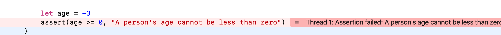

##基础部分

- 基础数据类型（Int、Float、Double、Bool、String）
- 基本的集合类型（ Array、Set 和 Dictionary）
- Swift 还增加了可选（Optional）类型，用于处理值缺失的情况
- Swift 是一门类型安全的语言，这意味着 Swift 可以让你清楚地知道值的类型

###常量和变量

常量：let a = 10

变量：var b = 0

一行多个变量：var x = 0.0, y = 0.0, z = 0.0

###类型注解
var welcomeMessage: String

###注释
option+command+?

###类型安全和类型推断
由于 Swift 是类型安全的，所以它会在编译你的代码时进行类型检查（type checks），并把不匹配的类型标记为错误。这可以让你在开发的时候尽早发现并修复错误。

###元组
元组（tuples）把多个值组合成一个复合值。元组内的值可以是任意类型，并不要求是相同类型。

```
let http404Error = (404, "Not Found")
// http404Error 的类型是 (Int, String)，值是 (404, "Not Found")
```
你可以将一个元组的内容分解（decompose）成单独的常量和变量，然后你就可以正常使用它们了：

```
let (statusCode, statusMessage) = http404Error
print("The status code is \(statusCode)")
// 输出“The status code is 404”
print("The status message is \(statusMessage)")
// 输出“The status message is Not Found”
```
你可以在定义元组的时候给单个元素命名：

```
let http200Status = (statusCode: 200, description: "OK")
```
给元组中的元素命名后，你可以通过名字来获取这些元素的值：

```
print("The status code is \(http200Status.statusCode)")
// 输出“The status code is 200”
print("The status message is \(http200Status.description)")
// 输出“The status message is OK”
```

###可选类型
使用可选类型（optionals）来处理值可能缺失的情况。可选类型表示两种可能： 或者有值， 你可以解析可选类型访问这个值， 或者根本没有值。

####nil

```
var serverResponseCode: Int? = 404
// serverResponseCode 包含一个可选的 Int 值 404
serverResponseCode = nil
// serverResponseCode 现在不包含值
```
如果你声明一个可选常量或者变量但是没有赋值，它们会自动被设置为 nil

```
var surveyAnswer: String?
// surveyAnswer 被自动设置为 nil
```
####if 语句以及强制解析
你可以使用 if 语句和 nil 比较来判断一个可选值是否包含值。你可以使用“相等”(==)或“不等”(!=)来执行比较。
如果可选类型有值，它将不等于 nil：

```
if convertedNumber != nil {
    print("convertedNumber contains some integer value.")
}
// 输出“convertedNumber contains some integer value.”
```
####可选绑定

使用可选绑定（optional binding）来判断可选类型是否包含值，如果包含就把值赋给一个临时常量或者变量。

```
if let constantName = someOptional {
    statements
}
```
**注意**

在 if 条件语句中使用常量和变量来创建一个可选绑定，仅在 if 语句的句中（body）中才能获取到值。相反，在 guard 语句中使用常量和变量来创建一个可选绑定，仅在 guard 语句外且在语句后才能获取到值

####隐式解析可选类型

有时候在程序架构中，第一次被赋值之后，可以确定一个可选类型总会有值。在这种情况下，每次都要判断和解析可选值是非常低效的，因为可以确定它总会有值。
这种类型的可选状态被定义为隐式解析可选类型

```
let possibleString: String? = "An optional string."
let forcedString: String = possibleString! // 需要感叹号来获取值

let assumedString: String! = "An implicitly unwrapped optional string."
let implicitString: String = assumedString  // 不需要感叹号
```

###错误处理
你可以使用 错误处理（error handling） 来应对程序执行中可能会遇到的错误条件。

```
do {
    try canThrowAnError()
    // 没有错误消息抛出
} catch {
    // 有一个错误消息抛出
}
```
###使用断言进行调试

